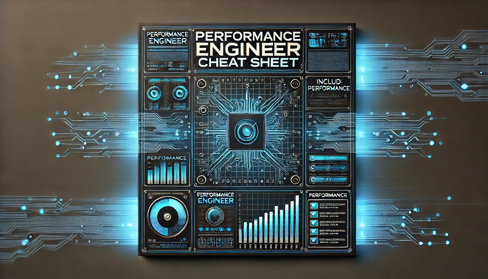

# Performance engineer cheat sheet

### Table of contents:
1. [CPU](cpu.md)
2. [Memory](memory.md)
3. [File system](filesystem.md)
4. [Network](network.md)

### Optimisation assumptions:
- Target metrics to optimise: latency, throughput, resource utilisation.
- Applicability: best optimisations may be performed on linux distributions running on bare metal. Clouds may be optimized too, but not that much.
- I divide optimisations into 4 categories: CPU, filesystem, memory, network. This is not a complete list, but a must-have minimum.
- Not all optimisations are applicable to all systems. Some of them may be harmful, so it is better to test them first.

### Who is this cheat sheet for:
- DevOps engineers who want to improve system performance.
- Performance engineers, who are in the beginning of their career.
- Developers who wants to learn more about systems performance outside high-level programming.
- Traders, who build robots and need to have the lowest latency.

### Who (most likely) not benefit from this cheat sheet:
- Experienced performance engineers, who already know all the tricks and have all scripts prepared.
- Someone who doesn't have access to underlying system and don't have permissions to change system settings.
- Teams, who don't care about cost of resources and don't have time to optimize.

### What is not included in the cheat sheet:
- Optimisation of the code itself. It is assumed that the code is already optimized. If developers don't follow best practices, reallocate memory too often, or use inefficient algorithms, it is better to fix the code first.
- Many aspects are only mentioned, but not explained in detail. The cheat sheet is a starting point for further research. I'm not giving complete instructions to run on production, just basic key points.

Notes are taken from the book "Systems Performance" by Gregg Brendan and from my own experience. The book is a must-read for performance engineers.